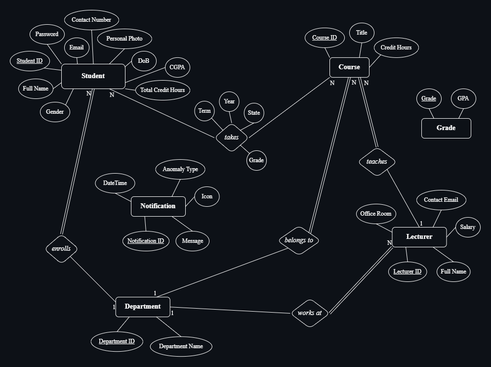

# University-Data-Management-System | Database

## About the database ##

Our database stores information about the university's students, departments, grading system, the courses each department provides, the lecturers that are working on the courses, and and enrollments of the students on the courses. Besides, it provides some functionalities such as calculating each student's CGPA or GPA for a specific term or year.

## Database Design ##

### <u>Entities</u>: ###

- __Students__

  | <u>Student ID</u>  | Full Name | Email | Password | Gender | DoB | Personal Photo | Contact Number | CGPA | Total Credit Hours |
  | --- | --- | --- | --- | --- | --- | --- | --- | --- | --- |

- __Courses__

  | <u>Course ID</u> | Title | Credit Hours |
  | --- | --- | --- |

- __Grades__

  | <u>Grade</u> | GPA |
  | --- | --- |

- __Departments__

  | <u>Department ID</u> | Department Name |
  | --- | --- |

- __Lecturers__

  | <u>Lecturer ID</u> | Full Name | Salary | Contact Email | Office Room |
  | --- | --- | --- | --- | --- |

---

### <u>Entity Relationship Diagram</u>: ###

  
  
<em>University Database Entity Relationship Diagram</em>

---

### <u>Relations</u>: ###

- __Student & Course__
    - A student can take `MANY` courses & a course can be assigned to `MANY` students.
    - A student `MAY` take the course & the course `MAY` be assigned to a student.
    - Attributes:
        - At which term (Spring - Autumn - Summer)
        - Year
        - State (In progress - Completed)
        - Grade (if completed - default `NULL`)
- __Course & Department__
    - A course is assigned to `ONE` department but the department can assign `MANY` courses.
    - A course `MUST` be assigned to a department but the department `MAY` have courses or not.
- __Student & Department__
    - A student enrolls in `ONE` department but the department can have `MANY` students.
    - A student `MUST` enroll in a department and the department `MAY` have students.
- __Lecturer & Department__
    - A lecturer works at `ONE` department but the department can have `MANY` lecturers.
    - A lecturer `MUST` be assigned to a department but the department `MAY` have lecturers or not.
- __Lecturer & Course__
    - A lecturer can teaches `MANY` courses and a course is taught by `ONE` lecturer.
    - A lecturer `MAY` teach a course but the course `MUST` be taught by a lecturer.

---

### <u>Mapping entities to actual tables</u>: ###

- __Departments__
    
    | <u>Department ID</u> | Department Name |
    | --- | --- |

- __Students__ (`enrolls`)
    
    | <u>Student ID</u> | Full Name | Email | Password | Gender | DoB | Personal Photo | Contact Number | CGPA | Total Credit Hours | *Department ID [FK]* |
    | --- | --- | --- | --- | --- | --- | --- | --- | --- | --- | --- |

- __Lecturers__ (`works at`)
    
    | <u>Lecturer ID</u> | Full Name | Salary | Contact Email | Office Room | *Department ID [FK]* |
    | --- | --- | --- | --- | --- | --- |

- __Courses__ (`belongs` & `teaches`)
    
    | <u>Course ID</u> | Title | Credit Hours | *Department ID [FK]* | *Lecturer ID [FK]* |
    | --- | --- | --- | --- | --- |

- __Grades__
    
    | <u>Grade</u> | GPA |
    | --- | --- |

- __Enrollments__ (`takes`)
    
    | <u>Enrollment ID</u> | *Student ID [FK]* | *Course ID [FK]* | Term | Year | State | *Grade [FK]* |
    | --- | --- | --- | --- | --- | --- | --- |

---