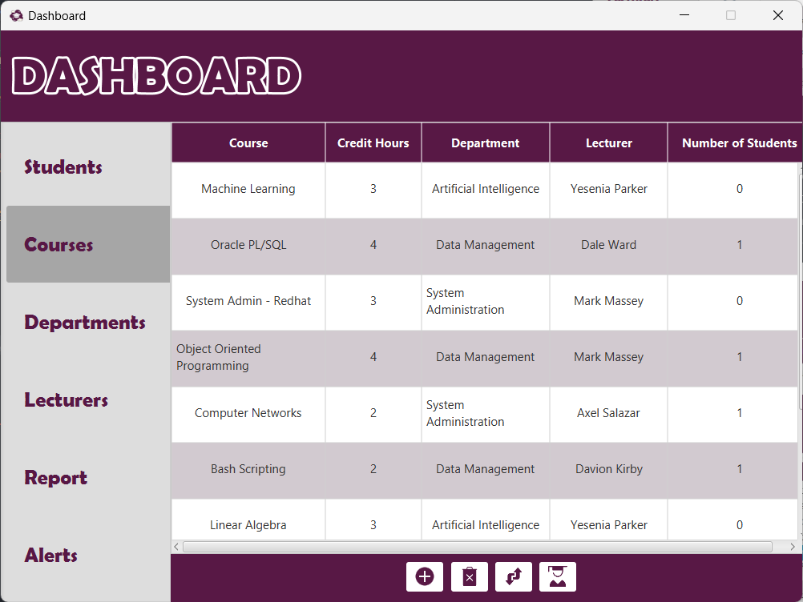
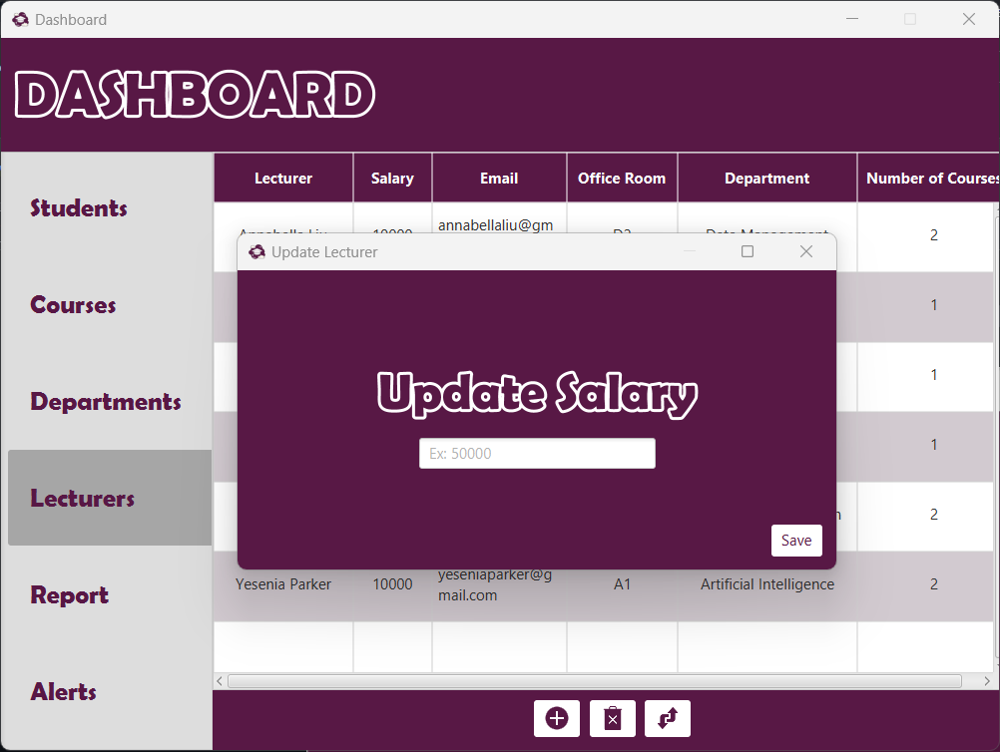

# University-Data-Management-System

## About the application ##

`Dashboard` application is a `Java` based application built with the `OOP` principles. It facilitates some tasks to the admins and IT members of the university to perform through a simple GUI.

---

## User Interface ##

The application mainly consists of a tab pane which is divided into 6 tabs.

1. Students
2. Courses
3. Departments
4. Lecturers
5. Report
6. Alerts

In the following section, you'll know what data each tab of the mentioned tabs provides, what functionalities it has, and how to use each of its functionalities easily.

### Students Tab ###

`Students` tab mainly shows information about all the students who are registered in the university. It also provides 3 functionalities, `add a new student`, `delete a student`, and `change a student's department`.

<div align="center">
  
  <p><em>Students tab in Dashboard application</em></p>
</div>

There's a button which is responsible of each functionality of these functionalities.

<div align="center">
  
  <p><em>Buttons of the Students tab</em></p>
</div>

- `Add a new student`

    Pressing on the `Add` button shows a new pane. This pane requires some information about the new student. Then pressing the `Add` button in this pane ensures inserting the student's data in the database.
    <div align="center">
    
    <p><em>Add a new student</em></p>
    </div>

- `Delete a student`

    Deleting a student requires selecting a student from the list of students. If there's no selected one an alert will be shown.
    <div align="center">
    
    </div>

    If there's a selected one, it'll be deleted once you press `OK` then the students list will be refreshed.
    <div align="center">
    
    <p><em>Deleting a student</em></p>
    </div>

- `Change a student's department`

    This feature also requires selecting a student to change its department, and it fires the same alert if there's no selected one.
    After selecting a student and press to change his/her department, the following pane will be shown. It includes a list of departments that are available in the university, and you're free to choose any of them.
    <div align="center">
    
    </div>

    After pressing the `Save` button, the student's department will be updated and the students list will be refreshed as well.

---

### Courses Tab ###

`Courses` tab mainly shows information about all the courses that are provided in the university. It provides 4 functionalities, `add a new course`, `delete a course`, `change a course's lecturer`, and `view all the enrolled students in a course`.

<div align="center">
    
    <p><em>Courses tab in Dashboard application</em></p>
</div>

There's a button which is responsible of each functionality of these functionalities.

<div align="center">
  
  <p><em>Buttons of the Courses tab</em></p>
</div>

- `Add a new course`

    Pressing on the `Add` button shows a new pane. This pane requires some information about the new course. Then pressing the `Add` button in this pane ensures inserting the courses's data in the database.
    <div align="center">
    
    <p><em>Add a new course</em></p>
    </div>

- `Delete a course`

    `Delete` button here works similarly as `Delete` button in the `Students` tab. _But, it has 2 options to follow:_
    1. Deleting the course after ensuring that there's no students that are enrolled in that course.
    2. Firing an alert which tells the admin that there's option to delete that course as there's still some students studying it.
        <div align="center">
        
        </div>

- `Change a course's lecturer`

    This feature changes the lecturer of any course you select. It shows a list of the lecturers that are working in the university to select among them.
    <div align="center">
    
    </div>
    After pressing the `Save` button, the courses's lecturer will be updated and the courses list will be refreshed as well.

- `View enrolled students`

    This feature shows the admin all the enrolled students of the selected course.
    <div align="center">
    
    </div>

---

### Departments Tab ###

`Departments` tab mainly shows information about all the departments that are in the university. It provides 2 functionalities, `add a new department`, and `delete a department`.

<div align="center">
    
    <p><em>Departments tab in Dashboard application</em></p>
</div>

There's a button which is responsible of each functionality of these functionalities.

<div align="center">
  
  <p><em>Buttons of the Departments tab</em></p>
</div>

The two functionalities work as in the `Courses` tab.

---

### Lecturers Tab ###

`Lecturers` tab mainly shows information about all the lecturers that are working in the university. It provides 3 functionalities, `add a new lecturer`, `delete a lecturer`, and `update a lecturer's salary`.

<div align="center">
    
    <p><em>Lecturers tab in Dashboard application</em></p>
</div>

There's a button which is responsible of each functionality of these functionalities. Each of them work as in the `Courses` and `Departments` tabs with a slight different thing which is `updating the salary`.

<div align="center">
  
  <p><em>Buttons of the Lecturers tab</em></p>
</div>

- `Update a lecturer's salary`

    After selecting a lecturer, the `Update Salary` pane is shown and requires the salary you want to update. After clicking `Save` button, the data will be updated.

    <div align="center">
    
    <p><em>Buttons of the Lecturers tab</em></p>
    </div>

---

### Report Tab ###

`Report` tab mainly shows some statistical information about all the data in the database that's related to the university. It shows _average GPA for each course_, _the number of courses that each department provides_, and _the number of students that are registered in each semester_.

<div align="center">
    
    <p><em>Report tab in Dashboard application</em></p>
</div>

---

### Alerts Tab ###

`Alerts` tab shows the issues and anomalies which are the admin should be aware of. These anomalies such as `Disk Monitoring`, `CPU Usage`, and `Memory Consumption` issues.

<div align="center">
    
    <p><em>Alerts tab in Dashboard application</em></p>
</div>

---

## Logic behind the application ##

_The application mainly follows 4 design patterns to be built in that way:_

1. `MVC` &rarr; Used in building the GUI.

   a. `Main` &rarr; The entry point of our application which is the class that `extends Application` and loads the first page of the application.
   
   b. `View` &rarr; The package that includes all the __FXML__ files of the tabs and panes.

   c. `Controller` &rarr; The package that includes all the __Java Classes__ that are responsible of handling the logic behind all the components used in each view.

2. `Singleton` &rarr; Used in the database connection process to let each method connect to the database and retreive, modify, or delete data through a single connection.

3. `DAO` &rarr; It acts as a bridge between the database and the application

4. `DTO` &rarr; It acts as a data store for the data that is retreived, modified, or deleted from the database.

So, the application has 5 packages: _Main_, _View_, _Controller_, _DAO_, and _DTO_. Besides, there's an extra package `resources` that stores all the _images_ and _css_ files used in the application.

_The tree of the project directory is as following:_
```sh
Admin
¦   
¦   
+---Controller
¦       AddCourseController.java
¦       AddDepartmentController.java
¦       AddLecturerController.java
¦       AddStudentController.java
¦       AdminController.java
¦       AlertsController.java
¦       CoursesController.java
¦       DepartmentsController.java
¦       EnrolledStudentsController.java
¦       LecturersController.java
¦       ReportController.java
¦       StudentsController.java
¦       UpdateCourseController.java
¦       UpdateLecturerController.java
¦       UpdateStudentController.java
¦       
+---DAO
¦       DBAddition.java
¦       DBConnection.java
¦       DBDeletion.java
¦       DBModification.java
¦       
+---DTO
¦       Alert.java
¦       Course.java
¦       CourseDept.java
¦       Department.java
¦       Enrollment.java
¦       Grade.java
¦       Lecturer.java
¦       LecturerDept.java
¦       Semester.java
¦       Student.java
¦       StudentDept.java
¦       
+---Main
¦       IStudentAdmin.java
¦       
+---resources
¦       add.png
¦       bar-chart.css
¦       cpu.png
¦       delete.png
¦       disk.png
¦       female.jpg
¦       logo.png
¦       male.jpg
¦       memory.png
¦       menna.jpeg
¦       pie-chart.css
¦       purple-alert.png
¦       student.png
¦       tab-pane.css
¦       table-view.css
¦       update.png
¦       
+---View
        AddCourse.fxml
        AddDepartment.fxml
        AddLecturer.fxml
        AddStudent.fxml
        Admin.fxml
        Alerts.fxml
        Courses.fxml
        Departments.fxml
        EnrolledStudents.fxml
        Lecturers.fxml
        Report.fxml
        Students.fxml
        UpdateCourse.fxml
        UpdateLecturer.fxml
        UpdateStudent.fxml
```

[Click here to view all the project's files.](Admin)

---