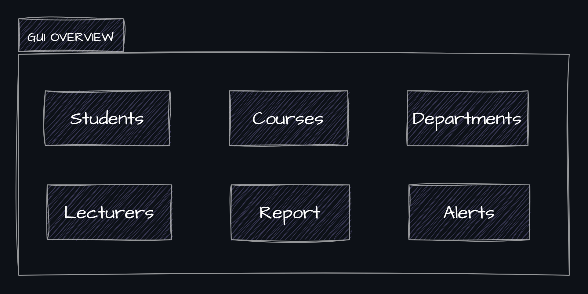

# University-Data-Management-System
This project aims to build a complete data management system for a university. It includes the database design of the university, the implementation of the database and its functionalities, the automation process of backing up the database and its information, and finally building an application to help the students track their performance.

The repository has 3 branches besides the `main`, `database`, `automation`, and `software`. Each branch includes all the work related to a part of the case study. Also, there're 3 folders, `Database`, `Automation`, `Java Application`. Each folder has a documentation of its own process and also has all the files, codes, scripts, and even images used in the case study.

## System Overview ##

_The data management system is divided into 3 main sub-systems:_
1. `Database`
2. `Automation`
3. `Java Application Development`

  
  
<em>University Data Management System Overview</em>

### <u>Database</u>: ###

_The database sub-system includes 3 main tasks:_
1. Designing a database for a university including the data of their students, courses, departments, lecturers, and grades.
2. Implementing the database on __Oracle DBMS__.
3. Writing some PL/SQL scripts to facilitate the process of showing, modifying, or deleting data from the database.

  
  
<em>Database Sub-system Overview</em>

---

### <u>Automation</u>: ###

The automation sub-system is responsible of automating some tasks related to the database or the system in general. _This subsystem has 2 main tasks:_

1. __Database Backup__ &rarr; Backing up the database's metadata and data regularly.
2. __System Monitoring__ &rarr; Monitoring the system resources such as _CPU, _Disk Usage_, and _Memory Consumption_. Also, sending alerts to the admin.

  
  
<em>Automation Sub-system Overview</em>

---

### <u>Java Application Development</u>: ###

_The java application development sub-system includes 3 main tasks:_
1. Building a Java based application to let the admin deals with the system's data easily through a user-friendy GUI.
2. Facilitating the process of adding, deleting, or modifying any piece of data.
3. Generating a report to show some statistical information to the admin, and gathering insights from it.

  
  
<em>Java Sub-system | GUI Overview</em>

  
  
<em>Java Sub-system | Main Structure Overview</em>

---

## System Integration ##

  
  
<em>University Data Management System Integration</em>

---